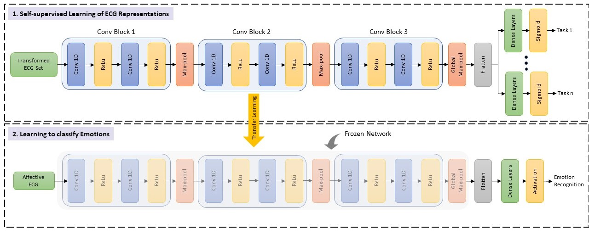

# Tensorflow (v1.14.0) implementation for "Self-supervised ECG Representation Learning for Emotion Recognition."

Folllowing are the papers associated with this project: 

**Journal version:** [Self-supervised ECG Representation Learning for Emotion Recognition](https://arxiv.org/abs/2002.03898)
Authors: [Sarkar](https://www.pritamsarkar.com/) and [Etemad](https://www.alietemad.com/)

**Conference version:** [Self-Supervised Learning for ECG-Based Emotion Recognition](https://ieeexplore.ieee.org/abstract/document/9053985)
Authors: [Sarkar](https://www.pritamsarkar.com/) and [Etemad](https://www.alietemad.com/)

## Proposed architecture

## Usage

- **implementation:** this directory contains all of our source codes.
    - Please create similar directory structure in your working directory:
        - *data_folder*: Keep your data in numpy format here.
        - *implementation*: Keep the codes here.
        - *summaries*: Tensorboard summaries will be saved here.
        - *output*: Loss and Results will be stored here.
        - *models*: Self-supervised models will be stored here.
 

- **load_model:** directory contains the pretrained self-supervised model and sample codes to use it.
    - The saved pretrained model can be used in order to extract features from raw ECG signals, which can be further used to perform downstream tasks.
    - We provide sample code for the above: [extract_features.py](https://gitlab.com/pritamqu/SSL-ECG/-/blob/master/load_model/extract_features.py).
    - In order to extract features, the input arrays must be in format of *batch_size x window_size*. We selected *window_size of 10 seconds X 256 Hz = 2560 samples*, where 256 Hz refers to the sampling rate. A sample ECG signal is given [here](https://gitlab.com/pritamqu/SSL-ECG/-/blob/master/load_model/sample_ecg.npy).
    - We also provide sample code in order to save the weights of our pretrained network: [save_weights.py](https://gitlab.com/pritamqu/SSL-ECG/-/blob/master/load_model/save_weights.py)
